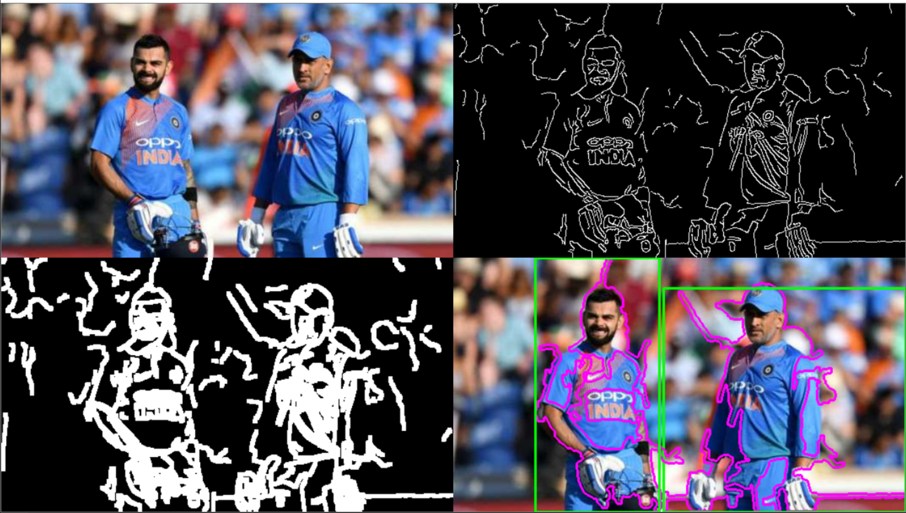

# IP
Image segmentation using contour detection

> Two apraoches to find contours in a image were made:
>
>> 1.Using simple threshold.
>
>> 2.image after edge detection and dialtion.

###### I wrote a simple code to find contours by both the apraoches.you can check out the code to see how it works .
* Input image
> 

* contour tracing thresholding image(threshold value-115)

* contour tracing after edge detection (threshold1 value-115 ,threshol2 40)

**we can see clearly that the image after edge detection gave better results than simple thresholding**
